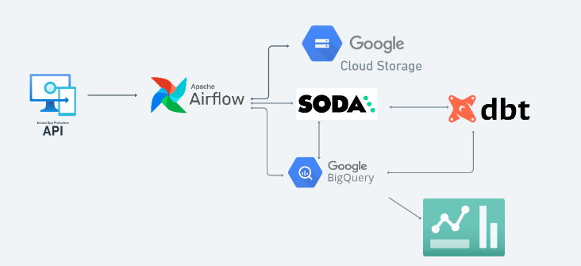
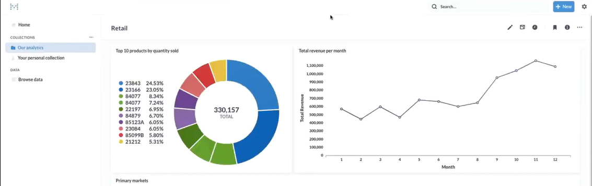

# E-Commerce Analytics

## Problem Description

The goal of this project is to develop a data engineering pipeline to analyze and visualize e-commerce data from an online store. The dataset includes information about customers, orders, products, and transactions. The objective is to transform the raw data into a structured format, perform data analysis, ensure data quality, and create interactive dashboards for business insights and decision-making.

## Overview

This project aims to develop a robust data engineering pipeline for analyzing and visualizing e-commerce data from an online store. Leveraging Apache Airflow for orchestration, dbt for data transformation, and Metabase for visualization, the pipeline ensures efficient data processing, quality assurance, and actionable insights generation

## Technology Used

The data engineering pipeline consists of the following stacks:

1. **Apache Airflow:** Orchestration tool for managing the data pipeline workflow.
2. **dbt (Data Build Tool):** Data transformation tool for building and managing data models.
3. **Metabase:** Business intelligence and visualization tool for creating interactive dashboards.
4. **Astro CLI:** Docker wrapper for Apache Airflow to simplify setup and management.
5. **Soda:** Data quality tool for performing data validation and quality checks.
6. **Google Cloud Platform (GCP):** Cloud infrastructure provider for hosting the project.
7. **Terraform:** Infrastructure as Code (IaC) tool for managing GCP resources, such as Google Cloud Storage (GCS) and BigQuery.

## Data Pipeline



## Getting Started

### Project Contents

The project contain the following files and folders:

- **dags:** This folder contains the Python files for the Airflow DAGs. By default.
- **Dockerfile:** This file contains a versioned Astro Runtime Docker image that provides a differentiated Airflow experience. If you want to execute other commands or overrides at runtime, specify them here.
- **docker-compose.override:** This file contains a Docker image for Metabase.
- **include:** This folder contains any additional files that you want to include as part of your project. It is empty by default.
- **terraform_gcp:** This folder contains terraform files used for setting up GCP infrastructures such as GCS and BigQuery.
- **packages.txt:** Install OS-level packages needed for your project by adding them to this file. It is empty by default.
- **requirements.txt:** Install Python packages needed for your project by adding them to this file. It is empty by default.
- **plugins:** Add custom or community plugins for your project to this file. It is empty by default.
- **airflow_settings.yaml:** Use this local-only file to specify Airflow Connections, Variables, and Pools instead of entering them in the Airflow UI as you develop DAGs in this project.

## Deploy the Project Locally

### Prerequisites

- Docker
- Python 3.x
  \_ Astro CLI
- Google Cloud Platform (GCP) account
- Terraform

### Steps

1. Clone the repository:

```bash
git clone https://github.com/samueloshio/estore-analytics.git

```

2. Start Airflow on your local machine by running.

- Astro CLI and docker are required. 👉Follow [Astro CLI Doc](https://docs.astronomer.io/astro/cli/overview) to set up Astro CLI

```bash
astro dev start
```

This command will spin up 4 Docker containers on your machine, each for a different Airflow component:

- Postgres: Airflow's Metadata Database
- Webserver: The Airflow component responsible for rendering the Airflow UI
- Scheduler: The Airflow component responsible for monitoring and triggering tasks
- Triggerer: The Airflow component responsible for triggering deferred tasks

2. Verify that all 4 Docker containers were created by running 'docker ps'.

Note: Running 'astro dev start' will start the project with the Airflow Webserver exposed at port 8080 and Postgres exposed at port 5432. If you already have either of those ports allocated, you can either [stop your existing Docker containers or change the port](https://docs.astronomer.io/astro/test-and-troubleshoot-locally#ports-are-not-available).

3. Setup your GCP account and terraform. Follow 👉 [Project infrastructure modules in GCP](/terraform_gcp/README.md) for more instructions.

4. Access the Airflow UI for your local Airflow project. To do so, go to http://localhost:8080/ and log in with 'admin' for both your Username and Password.

You should also be able to access your Postgres Database at 'localhost:5432/postgres'.

## Dashboard



## Data Sources

The e-commerce dataset used in this project contains information about customers, orders, products, and transactions. Sample data files are provided in the include/database/ directory.
Check the [dataset on Kaggle](https://www.kaggle.com/datasets/tunguz/online-retail) For more details.

## Deploy Your Project to Astronomer

If you have an Astronomer account, pushing code to a Deployment on Astronomer is simple. For deploying instructions, refer to Astronomer documentation: https://docs.astronomer.io/cloud/deploy-code/

## Contributing

Contributions are welcome! Feel free to submit pull requests or open issues for any improvements or bug fixes.
